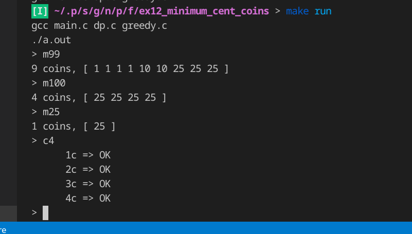

nセントを表すのに必要な最小のセント硬貨数は?
===

この課題はDPを実装してみようというものです。
しかし、セント硬貨の最小数を計算するにはGreedy法でも解けるのではないか？という疑問からDP版とGreedy法のどちらも実装しています。

Run
---

`make run`

起動するとプロンプトが表示されます。

次のようなコマンドがあります。

### Command
- `q`: q(uit). 終了
- `c%d`:
    c(ompare).
    DP版とGreedy法版を [0, n) の範囲で硬貨数が同一であるか比較します。同一ならば OK と表示され、そうでなければ違いが表示されます。  
    実際のところ、違いはありませんでした。1,6,9 の組み合わせだと 12 などで失敗するのですが、違いをどう証明するかがわかっていません。2倍?
- `m%d`: m(inimum). 最小のセント硬貨の数および組みあわせをDP版によって計算します。
